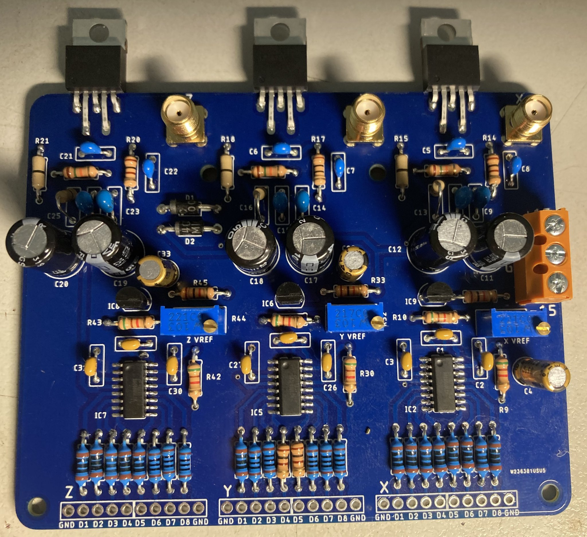

3-channel piezoelectric nanopositioning amplifier

Adapted from the design of Hwu et al, with a few small changes.

https://www.sciencedirect.com/science/article/pii/S2468067222000621#f0085

Changed to a commercially manufactured 2-layer PCB, as 2-layer professional PCBs are incredibly cheap and easily available today.
Made the PCB a little more compact.

Changed power amplifier ICs to LM1875 as they are more readily available.
Heatsinks need to be screwed onto the LM1875 amplifier tabs.

Changed to SMA connectors directly on the board, to more easily connect the outputs directly to the board.

Avoiding SMD components as much as possible, as science students (who aren't electronics specialists) often struggle with them.

